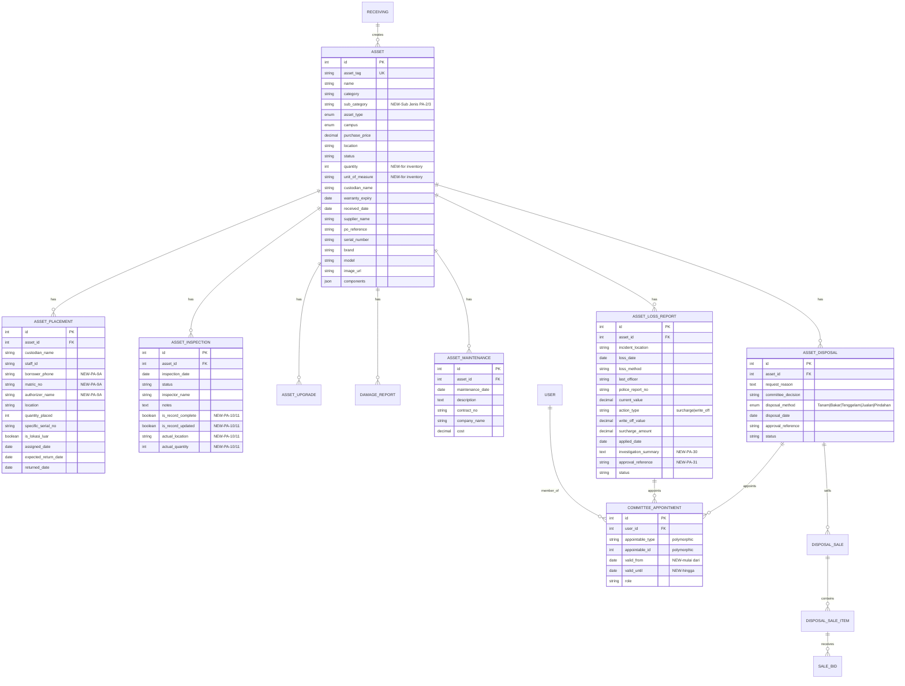

# CAIRO Inventory System — Verification Report & Implementation Plan

> **Last Updated:** 2026-04-24
> **Cross-Reference:** Trello Board Deconstruction + Gemini KEW.PA 1-32 PDF Analysis + Codebase Audit

## 1. Executive Summary

This report cross-references the existing CAIRO Inventory System codebase (Laravel 12 + React/Inertia) against the full KEW.PA form pipeline (forms 1–32) as deconstructed from the Trello board and Gemini analysis. The system has **strong foundational coverage** for the core receiving → registration → inspection → disposal workflow, but has **significant gaps** in maintenance tracking, loss reporting, vehicle disposal, and the tender/auction sub-system.

**Key Compliance Corrections (from Gemini PDF cross-reference):**
1. [`Asset`](app/Models/Asset.php) needs `sub_category` field for PA-2/PA-3 "Sub Jenis" classification
2. [`AssetPlacement`](app/Models/AssetPlacement.php) needs `borrower_phone`, `matric_no`, `authorizer_name` for PA-9A loan compliance
3. [`CommitteeAppointment`](app/Models/CommitteeAppointment.php) needs `valid_from` and `valid_until` date constraints
4. [`AssetDisposal`](app/Models/AssetDisposal.php) needs strict enum validation for `disposal_method` (Tanam/Bakar/Tenggelam/Jualan/Pindahan)
5. [`AssetLossReport`](app/Models/AssetLossReport.php) needs `investigation_summary` (PA-30) and `approval_reference` (PA-31)

---

## 2. Current System Architecture

### 2.1 Models (Existing)

| Model | Table | Purpose | KEW.PA Forms Covered |
|-------|-------|---------|----------------------|
| [`Asset`](app/Models/Asset.php) | `assets` | Core asset registry (fixed + inventory) | PA-2, PA-3 (header) |
| [`Receiving`](app/Models/Receiving.php) | `receivings` | Supplier delivery receiving | PA-1 (PA-1A) |
| [`AssetPlacement`](app/Models/AssetPlacement.php) | `asset_placements` | Custodian/location tracking | PA-6, PA-9A (loans) |
| [`AssetInspection`](app/Models/AssetInspection.php) | `asset_inspections` | Annual inspection records | PA-10, PA-11 (partial) |
| [`AssetUpgrade`](app/Models/AssetUpgrade.php) | `asset_upgrades` | Upgrades/replacements | PA-2 Bahagian B |
| [`DamageReport`](app/Models/DamageReport.php) | `damage_reports` | Damage/complaint reports | PA-9 |
| [`User`](app/Models/User.php) | `users` | Auth + role management | — |

### 2.2 Controllers (Existing)

| Controller | Routes | Purpose |
|------------|--------|---------|
| [`AssetController`](app/Http/Controllers/AssetController.php) | CRUD + KEW.PA-1/2/3 views + PDF downloads | Core asset management |
| [`AssetInspectionController`](app/Http/Controllers/AssetInspectionController.php) | Store inspection records | Inspection workflow |
| [`DamageReportController`](app/Http/Controllers/DamageReportController.php) | Store + KEW.PA-9 PDF | Damage reporting |
| [`ReportController`](app/Http/Controllers/Reportcontroller.php) | KEW.PA-4/5/8 views + PDF downloads | Annual summaries |
| [`DashboardController`](app/Http/Controllers/DashboardController.php) | User dashboard | User asset view |
| [`AdminDashboardController`](app/Http/Controllers/Admin/AdminDashboardController.php) | Admin dashboard | Admin analytics |

### 2.3 Frontend Pages (Existing)

| Page | Route | KEW.PA Form |
|------|-------|-------------|
| [`Kewpa1.jsx`](resources/js/Pages/Assets/Kewpa1.jsx) | `/receivings/{id}/kewpa1` | PA-1 (Receiving Report) |
| [`Kewpa2.jsx`](resources/js/Pages/Assets/Kewpa2.jsx) | `/assets/{id}/kewpa2` | PA-2 (Fixed Asset Register) |
| [`Kewpa3.jsx`](resources/js/Pages/Assets/Kewpa3.jsx) | `/assets/{id}/kewpa3` | PA-3 (Inventory Register) |
| [`Kewpa4.jsx`](resources/js/Pages/Reports/Kewpa4.jsx) | `/reports/kewpa4` | PA-4 (Fixed Asset List) |
| [`Kewpa5.jsx`](resources/js/Pages/Reports/Kewpa5.jsx) | `/reports/kewpa5` | PA-5 (Inventory List) |
| [`Kewpa8.jsx`](resources/js/Pages/Reports/Kewpa8.jsx) | `/reports/kewpa8` | PA-8 (Annual Report) |

---

## 3. KEW.PA Form Coverage Matrix

### 🟢 COMPLETED (Code Exists)

| Form | Name | Model | Controller | View | PDF |
|------|------|-------|-----------|------|-----|
| **PA-1** | Laporan Penerimaan Aset | [`Receiving`](app/Models/Receiving.php) | [`AssetController`](app/Http/Controllers/AssetController.php) | [`Kewpa1.jsx`](resources/js/Pages/Assets/Kewpa1.jsx) | ✅ |
| **PA-2** | Daftar Harta Tetap | [`Asset`](app/Models/Asset.php) | [`AssetController`](app/Http/Controllers/AssetController.php) | [`Kewpa2.jsx`](resources/js/Pages/Assets/Kewpa2.jsx) | ✅ |
| **PA-3** | Daftar Inventori | [`Asset`](app/Models/Asset.php) | [`AssetController`](app/Http/Controllers/AssetController.php) | [`Kewpa3.jsx`](resources/js/Pages/Assets/Kewpa3.jsx) | ✅ |
| **PA-4** | Senarai Harta Tetap | `Asset` (query) | [`ReportController`](app/Http/Controllers/Reportcontroller.php) | [`Kewpa4.jsx`](resources/js/Pages/Reports/Kewpa4.jsx) | ✅ |
| **PA-5** | Senarai Inventori | `Asset` (query) | [`ReportController`](app/Http/Controllers/Reportcontroller.php) | [`Kewpa5.jsx`](resources/js/Pages/Reports/Kewpa5.jsx) | ✅ |
| **PA-8** | Laporan Tahunan | `Asset` (query) | [`ReportController`](app/Http/Controllers/Reportcontroller.php) | [`Kewpa8.jsx`](resources/js/Pages/Reports/Kewpa8.jsx) | ✅ |
| **PA-9** | Aduan Kerosakan | [`DamageReport`](app/Models/DamageReport.php) | [`DamageReportController`](app/Http/Controllers/DamageReportController.php) | Modal in PA-2/PA-3 | ✅ |

### 🟡 PARTIALLY COMPLETED (Needs Expansion)

| Form | Name | Status | Gap |
|------|------|--------|-----|
| **PA-6** | Daftar Pergerakan | Partial | [`AssetPlacement`](app/Models/AssetPlacement.php) exists but no dedicated PA-6 view/PDF |
| **PA-7** | Senarai Aset Mengikut Lokasi | Partial | No dedicated page — needs a controller query + view |
| **PA-9A** | Borang Pinjaman | Partial | [`AssetPlacement`](app/Models/AssetPlacement.php) handles this but no dedicated loan form view |
| **PA-10/11** | Laporan Pemeriksaan | Partial | [`AssetInspection`](app/Models/AssetInspection.php) exists but **missing** `is_record_complete`, `is_record_updated`, `actual_location`, `actual_quantity` fields |
| **PA-12** | Sijil Tahunan Pemeriksaan | Missing | Needs a certification view + PDF (aggregated from inspections) |

### 🔴 MISSING (New Models Required)

| Form | Name | What's Needed |
|------|------|---------------|
| **PA-13/14** | Penyelenggaraan (Maintenance) | **New Model**: [`AssetMaintenance`](app/Models/AssetMaintenance.php) — tracks repair work, contractor, cost |
| **PA-15** | Pelantikan Jawatankuasa Pemeriksa Pelupusan | **New Model**: [`CommitteeAppointment`](app/Models/CommitteeAppointment.php) — links users to disposal events |
| **PA-16** | Perakuan Pelupusan Kenderaan | **New Model**: [`VehicleDisposalAssessment`](app/Models/VehicleDisposalAssessment.php) — vehicle-specific disposal fields |
| **PA-17/18/19** | Pelupusan (Disposal Workflow) | **New Model**: [`AssetDisposal`](app/Models/AssetDisposal.php) — full disposal pipeline |
| **PA-20** | Laporan Tahunan Pelupusan | Controller query (aggregate from `AssetDisposal`) |
| **PA-21→27A** | Tender/Sebutharga/Lelongan | **New Models**: [`DisposalSale`](app/Models/DisposalSale.php), [`DisposalSaleItem`](app/Models/DisposalSaleItem.php), [`SaleBid`](app/Models/SaleBid.php) |
| **PA-28→30** | Kehilangan & Hapuskira | **New Model**: [`AssetLossReport`](app/Models/AssetLossReport.php) — loss investigation workflow |
| **PA-29** | Pelantikan Jawatankuasa Penyiasat Kehilangan | Reuse [`CommitteeAppointment`](app/Models/CommitteeAppointment.php) linked to loss events |
| **PA-31** | Laporan Polis / Kehilangan | Fields in [`AssetLossReport`](app/Models/AssetLossReport.php) |
| **PA-32** | Laporan Tindakan Kehilangan | Fields in [`AssetLossReport`](app/Models/AssetLossReport.php) — surcharge/write-off tracking |

---

## 4. Gap Analysis & Detailed Findings

### 4.1 Database Schema Gaps

#### [`Asset`](app/Models/Asset.php) — Missing Fields
**Missing for PA-2/PA-3 compliance:**
- `sub_category` (string, nullable) — "Sub Jenis" classification (e.g., "Komputer", "Perabot", "Mesin")
- `quantity` (integer, default: 1) — for inventory items (currently hardcoded as 1 in PA-3 view)
- `unit_of_measure` (string, default: 'Unit') — "Unit", "Set", "Kg", etc.

#### [`AssetInspection`](app/Models/AssetInspection.php) — Needs Expansion
Current fields: `asset_id`, `inspection_date`, `status`, `inspector_name`, `notes`
**Missing for PA-10/11 compliance:**
- `is_record_complete` (boolean) — "Lengkap" checkbox (daftar lengkap?)
- `is_record_updated` (boolean) — "Kemaskini" checkbox (daftar dikemaskini?)
- `actual_location` (string, nullable) — actual location vs. recorded location
- `actual_quantity` (integer, nullable) — for inventory items (kuantiti sebenar vs. rekod)

#### [`AssetPlacement`](app/Models/AssetPlacement.php) — Needs Expansion for PA-9A
Current fields handle basic custodian tracking.
**Missing for PA-9A (Loan Form) compliance:**
- `borrower_phone` (string, nullable) — "No. Tel. Bimbit" of borrower
- `matric_no` (string, nullable) — "No. Staf/Matrik" of borrower
- `authorizer_name` (string, nullable) — "Maklumat Penyerah/Pemberi Pinjam Alatan" (officer authorizing the loan)

#### No Maintenance Model
PA-13/PA-14 require tracking:
- `asset_id`, `maintenance_date`, `description`, `contract_no`, `company_name`, `cost`

#### No Disposal Model
PA-17/18/19 require tracking:
- `asset_id`, `request_reason`, `committee_decision`, `disposal_method` (enum: Tanam/Bakar/Tenggelam/Jualan/Pindahan), `disposal_date`, `approval_reference`

#### No Loss Report Model
PA-28→32 require tracking:
- `asset_id`, `incident_location`, `loss_date`, `loss_method`, `last_officer`, `police_report_no`, `current_value`, `action_type` (surcharge/write-off), `write_off_value`, `surcharge_amount`, `applied_date`, `investigation_summary` (text — PA-30), `approval_reference` (string — PA-31)

#### No Committee Appointment Model
PA-15/PA-29 require tracking:
- `user_id`, `appointable_type`, `appointable_id` (polymorphic to disposal/loss events)
- `valid_from` (date) — "mulai dari..."
- `valid_until` (date) — "hingga..."

### 4.2 Controller Gaps

| Missing Controller/Endpoint | Priority | Reason |
|---------------------------|----------|--------|
| MaintenanceController (PA-13/14) | High | Required for repair tracking |
| DisposalController (PA-17→19) | High | Required for asset retirement workflow |
| LossReportController (PA-28→32) | Medium | Required for loss/theft workflow |
| LocationReportController (PA-7) | Low | Simple query aggregation |
| AnnualCertificationController (PA-12) | Low | Simple certification PDF |

### 4.3 Frontend Gaps

| Missing Page | Priority | Notes |
|-------------|----------|-------|
| PA-6 Movement Register view | Medium | Could be a table view of placements |
| PA-7 Location-based asset list | Low | Simple report page |
| PA-9A Loan form view | Medium | Dedicated loan form |
| PA-10/11 Inspection report view | High | Needs expanded fields |
| PA-12 Annual Certification | Low | Simple certification form |
| PA-13/14 Maintenance form | High | New feature |
| PA-16 Vehicle Disposal | Low | Only if UTM manages vehicles |
| PA-17→19 Disposal workflow | High | Multi-step approval |
| PA-20 Annual Disposal Report | Low | Aggregate query |
| PA-21→27A Tender system | Low | Complex sub-system |
| PA-28→32 Loss Report workflow | Medium | Multi-step investigation |

### 4.4 Spatie Media Library Integration (In Progress)

The Trello board lists this as a current focus. Currently:
- Asset photo upload uses basic `store('asset_photos', 'public')` in [`AssetController::acceptReceiving()`](app/Http/Controllers/AssetController.php:54)
- No `InteractsWithMedia` trait used
- No `spatie/laravel-medialibrary` package in [`composer.json`](composer.json)

**Action Required:** Install `spatie/laravel-medialibrary`, update `Asset` model, refactor photo upload logic.

### 4.5 Pemeriksaan Section (In Progress)

The inspection workflow exists but is minimal:
- [`AssetInspectionController::store()`](app/Http/Controllers/AssetInspectionController.php) only validates `inspection_date`, `status`, `notes`
- Missing the expanded PA-10/11 fields (record completeness, location verification)
- No dedicated inspection report view or PDF

---

## 5. Implementation Plan (Prioritized Todo List)

> **Note:** All compliance corrections from Gemini PDF cross-reference are baked into the schema definitions below.

### Phase 1: Foundation & In-Progress Work
1. **Install Spatie Media Library** — Add `spatie/laravel-medialibrary` to composer, publish config, run migrations
2. **Refactor Asset Model** — Add `InteractsWithMedia` trait, update photo upload in `acceptReceiving()`
3. **Add `sub_category` to Asset** — Migration for PA-2/PA-3 "Sub Jenis" field
4. **Add Inventory Quantity Fields** — Migration for `quantity` and `unit_of_measure` on `assets` table
5. **Expand AssetInspection Model** — Migration for `is_record_complete`, `is_record_updated`, `actual_location`, `actual_quantity`
6. **Expand AssetPlacement for PA-9A** — Migration for `borrower_phone`, `matric_no`, `authorizer_name`

### Phase 2: Maintenance & Disposal Core
7. **Create AssetMaintenance Model + Migration** — PA-13/14 support with `maintenance_date`, `description`, `contract_no`, `company_name`, `cost`
8. **Create AssetDisposal Model + Migration** — PA-17/18/19 support with `disposal_method` enum (Tanam/Bakar/Tenggelam/Jualan/Pindahan), `request_reason`, `committee_decision`, `approval_reference`
9. **Create CommitteeAppointment Model + Migration** — PA-15/PA-29 with `valid_from`, `valid_until` date constraints (polymorphic to disposal/loss events)
10. **Build MaintenanceController** — CRUD + PA-13/14 PDF export
11. **Build DisposalController** — Approval workflow + PA-17/18/19 PDF export

### Phase 3: Loss & Investigation
12. **Create AssetLossReport Model + Migration** — PA-28→32 support with `investigation_summary` (PA-30), `approval_reference` (PA-31), `action_type` (surcharge/write-off)
13. **Build LossReportController** — Investigation workflow + PA-28/30/32 PDF export

### Phase 4: Reporting & UI Completion
14. **Build PA-6 Movement Register** — View + PDF (from AssetPlacement data)
15. **Build PA-7 Location Report** — View + PDF (aggregate query)
16. **Build PA-9A Loan Form** — Dedicated loan view with borrower phone, matric no, authorizer fields
17. **Build PA-10/11 Inspection Report** — Expanded inspection view + PDF with completeness flags and location verification
18. **Build PA-12 Annual Certification** — Simple certification form + PDF
19. **Build PA-20 Annual Disposal Report** — Aggregate query + PDF

### Phase 5: Advanced Features (Backlog)
20. **Vehicle Disposal (PA-16)** — If UTM manages vehicles
21. **Tender/Sebutharga/Lelongan (PA-21→27A)** — Complex sub-system (DisposalSale, DisposalSaleItem, SaleBid)
22. **Landing Page** — Frontend UI/UX task

---

## 6. Entity Relationship Diagram (Updated with Compliance Corrections)

---

## 7. Key Observations

1. **Strong Foundation**: The core receiving → registration workflow (PA-1→PA-3) is well-implemented with proper PDF generation using Spatie Laravel PDF + Browsershot.

2. **Annual Reports Done Right**: PA-4, PA-5, and PA-8 are implemented as aggregate queries rather than separate models — the correct architectural approach.

3. **Disposal is Placeholder**: The PA-2/PA-3 views show a "Pelupusan" table but it only checks `asset.status === 'disposed'` with no dedicated model. The disposal workflow needs a full model + approval pipeline.

4. **Inspection Needs Expansion**: The current [`AssetInspection`](app/Models/AssetInspection.php) model is too minimal for PA-10/11 compliance. The Gemini analysis correctly identifies the need for record completeness flags and location verification fields.

5. **No Spatie Media Library Yet**: Despite being listed as "In Progress" on the Trello board, there's no `spatie/laravel-medialibrary` package installed. Photo upload uses basic Laravel file storage.

6. **Inventory Quantity Missing**: The [`Asset`](app/Models/Asset.php) model lacks `quantity` and `unit_of_measure` fields, which are required for PA-3 compliance. Currently hardcoded as `1` and `'Unit'` in the frontend.

7. **Refactor Flow**: The Trello board mentions "Refactor Flow" as in-progress. The codebase appears reasonably clean, but could benefit from standardized API response formats and service layer extraction for complex business logic.
