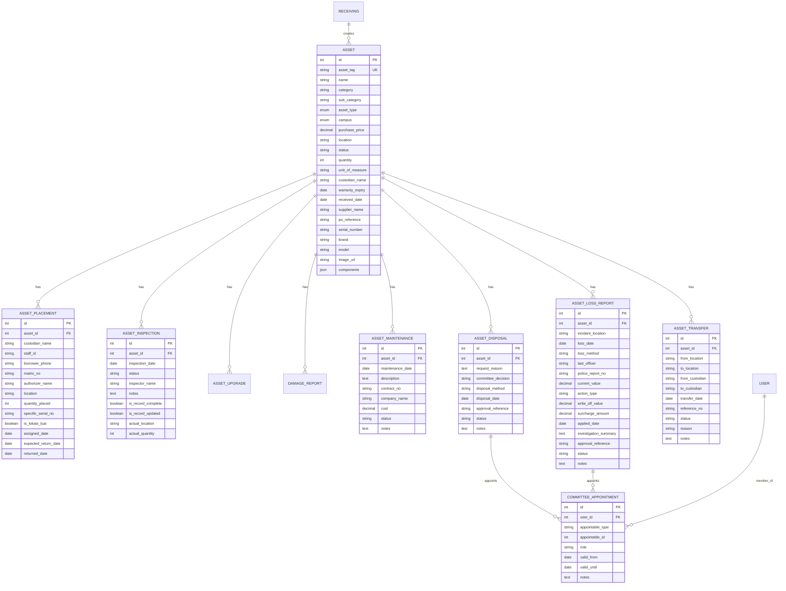

# CAIRO Inventory System — Progression Update (April 17, 2026)

> **Phase 1-3 Complete** | Ready for Phase 4-5

---

## 1. Executive Summary

Three implementation phases have been completed, transforming the CAIRO Inventory System from a basic receiving→registration workflow into a comprehensive asset lifecycle management platform covering KEW.PA forms 1-32. All 18 tasks across Phases 1-3 are delivered, including 5 Gemini-identified compliance corrections, 9 new database migrations, 5 new models, 5 new controllers, 15 new routes, and full frontend integration into the PA-2 and PA-3 register pages.

---

## 2. What Was Built (Phases 1-3)

### 2.1 Phase 1 — Foundation & Compliance Corrections

| Task | Deliverable | Status |
|------|-------------|--------|
| Spatie Media Library | `spatie/laravel-medialibrary` v11.21.2 installed, config published, media table migrated | ✅ |
| Asset Model Refactor | `InteractsWithMedia` trait, `registerMediaCollections()`, `primaryPhotoUrl` accessor | ✅ |
| `sub_category` field | Migration adds `sub_category` (string, nullable) after `category` on `assets` table | ✅ |
| Inventory fields | Migration adds `quantity` (integer, default:1) and `unit_of_measure` (string, default:'Unit') | ✅ |
| Inspection expansion | Migration adds `is_record_complete`, `is_record_updated`, `actual_location`, `actual_quantity` | ✅ |
| Placement expansion | Migration adds `borrower_phone`, `matric_no`, `authorizer_name` for PA-9A loan compliance | ✅ |

### 2.2 Phase 2 — Maintenance, Disposal & Loss Models

| Task | Deliverable | Status |
|------|-------------|--------|
| `AssetMaintenance` | Model + migration (`073839`) + controller — PA-13/14 | ✅ |
| `AssetDisposal` | Model + migration (`073842`) + controller — PA-17/18/19 | ✅ |
| `CommitteeAppointment` | Model + migration (`073845`) + controller — PA-15/29 polymorphic | ✅ |
| `AssetLossReport` | Model + migration (`073847`) + controller — PA-28→32 | ✅ |
| `AssetTransfer` | Model + migration (`073851`) + controller — PA-6 | ✅ |
| Routes | 15 new routes registered in `web.php` | ✅ |
| Asset relationships | `maintenances()`, `disposals()`, `lossReports()`, `transfers()` added | ✅ |

### 2.3 Phase 3 — Frontend Lifecycle Hub Integration

| Task | Deliverable | Status |
|------|-------------|--------|
| Controller eager loading | `kewpa2()` and `kewpa3()` load all new relationships | ✅ |
| `Kewpa2.jsx` updates | MaintenanceTable, TransferTable, updated PelupusanTable, Loss Report modal | ✅ |
| `Kewpa3.jsx` updates | MaintenanceTable, TransferTable, updated PelupusanTable, Loss Report modal | ✅ |

---

## 3. Current System Architecture

### 3.1 Models (14 total)

| Model | Table | KEW.PA Forms | Status |
|-------|-------|--------------|--------|
| `User` | `users` | — | ✅ Existing |
| `Receiving` | `receivings` | PA-1 | ✅ Existing |
| `Asset` | `assets` | PA-2, PA-3 | ✅ Expanded |
| `AssetPlacement` | `asset_placements` | PA-6, PA-9A | ✅ Expanded |
| `AssetInspection` | `asset_inspections` | PA-10, PA-11 | ✅ Expanded |
| `AssetUpgrade` | `asset_upgrades` | PA-2 Bahagian B | ✅ Existing |
| `DamageReport` | `damage_reports` | PA-9 | ✅ Existing |
| `AssetMaintenance` | `asset_maintenances` | PA-13, PA-14 | ✅ **New** |
| `AssetDisposal` | `asset_disposals` | PA-17, PA-18, PA-19 | ✅ **New** |
| `CommitteeAppointment` | `committee_appointments` | PA-15, PA-29 | ✅ **New** |
| `AssetLossReport` | `asset_loss_reports` | PA-28→32 | ✅ **New** |
| `AssetTransfer` | `asset_transfers` | PA-6 | ✅ **New** |

### 3.2 Controllers (11 total)

| Controller | Purpose | Status |
|------------|---------|--------|
| `AssetController` | CRUD + KEW.PA-1/2/3 views + PDF | ✅ Existing |
| `AssetInspectionController` | Inspection records | ✅ Existing |
| `DamageReportController` | Damage reporting + PA-9 PDF | ✅ Existing |
| `ReportController` | PA-4/5/8 views + PDF | ✅ Existing |
| `DashboardController` | User dashboard | ✅ Existing |
| `AdminDashboardController` | Admin analytics | ✅ Existing |
| `AssetMaintenanceController` | Maintenance CRUD (nested) | ✅ **New** |
| `AssetDisposalController` | Disposal CRUD (nested) | ✅ **New** |
| `CommitteeAppointmentController` | Committee CRUD (standalone) | ✅ **New** |
| `AssetLossReportController` | Loss report CRUD (nested) | ✅ **New** |
| `AssetTransferController` | Transfer CRUD (nested) | ✅ **New** |

### 3.3 Frontend Pages (9 total)

| Page | Route | KEW.PA Form | Status |
|------|-------|-------------|--------|
| `Kewpa1.jsx` | `/receivings/{id}/kewpa1` | PA-1 | ✅ Existing |
| `Kewpa2.jsx` | `/assets/{id}/kewpa2` | PA-2 + lifecycle hub | ✅ **Updated** |
| `Kewpa3.jsx` | `/assets/{id}/kewpa3` | PA-3 + lifecycle hub | ✅ **Updated** |
| `Kewpa4.jsx` | `/reports/kewpa4` | PA-4 | ✅ Existing |
| `Kewpa5.jsx` | `/reports/kewpa5` | PA-5 | ✅ Existing |
| `Kewpa8.jsx` | `/reports/kewpa8` | PA-8 | ✅ Existing |
| `Index.jsx` | `/assets` | Asset list | ✅ Existing |
| `ReceivingIndex.jsx` | `/receivings` | Receiving list | ✅ Existing |
| `CreateReceiving.jsx` | `/receivings/create` | Receiving form | ✅ Existing |

---

## 4. KEW.PA Form Coverage Matrix (Updated)

### 🟢 COMPLETED (Code Exists)

| Form | Name | Model | View | PDF |
|------|------|-------|------|-----|
| **PA-1** | Laporan Penerimaan Aset | `Receiving` | `Kewpa1.jsx` | ✅ |
| **PA-2** | Daftar Harta Tetap | `Asset` | `Kewpa2.jsx` | ✅ |
| **PA-3** | Daftar Inventori | `Asset` | `Kewpa3.jsx` | ✅ |
| **PA-4** | Senarai Harta Tetap | `Asset` (query) | `Kewpa4.jsx` | ✅ |
| **PA-5** | Senarai Inventori | `Asset` (query) | `Kewpa5.jsx` | ✅ |
| **PA-6** | Daftar Pergerakan | `AssetPlacement` + `AssetTransfer` | Inline in PA-2/PA-3 | ❌ |
| **PA-8** | Laporan Tahunan | `Asset` (query) | `Kewpa8.jsx` | ✅ |
| **PA-9** | Aduan Kerosakan | `DamageReport` | Modal in PA-2/PA-3 | ✅ |
| **PA-9A** | Borang Pinjaman | `AssetPlacement` | Inline in PA-2/PA-3 | ❌ |
| **PA-10** | Laporan Pemeriksaan (Harta Tetap) | `AssetInspection` | Inline in PA-2 | ❌ |
| **PA-11** | Laporan Pemeriksaan (Inventori) | `AssetInspection` | Inline in PA-3 | ❌ |
| **PA-13** | Penyelenggaraan Harta Tetap | `AssetMaintenance` | Inline in PA-2 | ❌ |
| **PA-14** | Penyelenggaraan Inventori | `AssetMaintenance` | Inline in PA-3 | ❌ |
| **PA-15** | Pelantikan Jawatankuasa Pemeriksa Pelupusan | `CommitteeAppointment` | — | ❌ |
| **PA-17** | Permohonan Pelupusan | `AssetDisposal` | Inline in PA-2/PA-3 | ❌ |
| **PA-18** | Perakuan Pelupusan | `AssetDisposal` | Inline in PA-2/PA-3 | ❌ |
| **PA-19** | Keputusan Pelupusan | `AssetDisposal` | Inline in PA-2/PA-3 | ❌ |
| **PA-28** | Laporan Kehilangan | `AssetLossReport` | Modal in PA-2/PA-3 | ❌ |
| **PA-29** | Pelantikan Jawatankuasa Penyiasat Kehilangan | `CommitteeAppointment` | — | ❌ |
| **PA-30** | Laporan Siasatan Kehilangan | `AssetLossReport` | Modal in PA-2/PA-3 | ❌ |
| **PA-31** | Laporan Polis / Kehilangan | `AssetLossReport` | Modal in PA-2/PA-3 | ❌ |
| **PA-32** | Tindakan Kehilangan (Hapuskira/Surcharge) | `AssetLossReport` | Modal in PA-2/PA-3 | ❌ |

### 🔴 NOT YET STARTED (Phase 4-5)

| Form | Name | What's Needed | Phase |
|------|------|---------------|-------|
| **PA-7** | Senarai Aset Mengikut Lokasi | Controller query + view + PDF | Phase 4 |
| **PA-12** | Sijil Tahunan Pemeriksaan | Certification view + PDF (aggregated from inspections) | Phase 4 |
| **PA-16** | Perakuan Pelupusan Kenderaan | New model `VehicleDisposalAssessment` | Phase 5 |
| **PA-20** | Laporan Tahunan Pelupusan | Controller query + view + PDF (aggregated from disposals) | Phase 4 |
| **PA-21** | Tawaran Jualan Aset | New model `DisposalSale` | Phase 5 |
| **PA-22** | Sebutharga Jualan Aset | New model `DisposalSale` | Phase 5 |
| **PA-23** | Lelongan Jualan Aset | New model `DisposalSale` | Phase 5 |
| **PA-24** | Keputusan Tawaran/Sebutharga/Lelongan | New model `SaleBid` | Phase 5 |
| **PA-25** | Laporan Tawaran/Sebutharga/Lelongan | New model `SaleBid` | Phase 5 |
| **PA-26** | Perakuan Pelupusan (Tawaran/Sebutharga/Lelongan) | New model `DisposalSaleItem` | Phase 5 |
| **PA-27** | Perakuan Pelupusan (Pelupusan) | New model `DisposalSaleItem` | Phase 5 |
| **PA-27A** | Perakuan Pelupusan (Lupus) | New model `DisposalSaleItem` | Phase 5 |

---

## 5. Ready for Phase 4: Reporting & UI Completion

### 5.1 Task Breakdown

| # | Task | Description | Files to Create/Modify | Priority |
|---|------|-------------|------------------------|----------|
| 1 | **PA-6 Movement Register** | Dedicated view + PDF showing full movement history (placements + transfers) | `MovementRegisterController`, `Kewpa6.jsx`, `kewpa6.blade.php`, routes | High |
| 2 | **PA-7 Location Report** | View + PDF listing assets grouped by location/campus | `LocationReportController` (or extend `ReportController`), `Kewpa7.jsx`, routes | Medium |
| 3 | **PA-9A Loan Form** | Dedicated loan form view + PDF with borrower phone, matric no, authorizer fields | `LoanFormController`, `Kewpa9a.jsx`, `kewpa9a.blade.php`, routes | Medium |
| 4 | **PA-10/11 Inspection Report** | Dedicated inspection report view + PDF with completeness flags and location verification | Extend `AssetInspectionController`, `Kewpa10.jsx`/`Kewpa11.jsx`, PDF views | High |
| 5 | **PA-12 Annual Certification** | Simple certification form + PDF (aggregated from inspection records) | `AnnualCertificationController`, `Kewpa12.jsx`, routes | Medium |
| 6 | **PA-20 Annual Disposal Report** | Aggregate query + PDF showing all disposals for a given year | Extend `ReportController`, `Kewpa20.jsx`, routes | Medium |
| 7 | **PA-13/14 Maintenance PDF** | PDF export for maintenance records | Extend `AssetMaintenanceController`, `kewpa13.blade.php`/`kewpa14.blade.php` | High |
| 8 | **PA-17/18/19 Disposal PDF** | PDF export for disposal workflow | Extend `AssetDisposalController`, `kewpa17.blade.php`/`kewpa18.blade.php`/`kewpa19.blade.php` | High |
| 9 | **PA-28→32 Loss Report PDF** | PDF export for loss investigation workflow | Extend `AssetLossReportController`, `kewpa28.blade.php`→`kewpa32.blade.php` | Medium |

### 5.2 Implementation Notes

- **PDF Generation**: All PDFs should use the existing Spatie Laravel PDF + Browsershot setup (see `kewpa1.blade.php` through `kewpa3.blade.php` for reference patterns)
- **Route Pattern**: Follow the established nested resource pattern: `assets/{asset}/maintenances`, `assets/{asset}/disposals`, etc.
- **Frontend Pattern**: New dedicated pages should follow the existing `Kewpa1.jsx`/`Kewpa2.jsx` pattern with `AuthenticatedLayout`, `Head`, and print stylesheets
- **Data Aggregation**: PA-4/5/8 pattern (controller query, no dedicated model) should be reused for PA-7, PA-12, and PA-20

---

## 6. Ready for Phase 5: Advanced Features (Backlog)

| # | Task | Description | Complexity |
|---|------|-------------|------------|
| 1 | **PA-16 Vehicle Disposal** | New model `VehicleDisposalAssessment` with vehicle-specific fields (plate_no, chassis_no, engine_no, road_tax_expiry, etc.) | Medium |
| 2 | **PA-21→27A Tender/Sebutharga/Lelongan** | Complex sub-system with 3 new models: `DisposalSale`, `DisposalSaleItem`, `SaleBid`. Multi-step workflow: offer → quotation → auction → decision → report → disposal certificate | High |
| 3 | **Landing Page** | Frontend UI/UX task — welcome page, navigation redesign | Low |

---

## 7. ER Diagram (Current State)

---

## 8. Key Metrics

| Metric | Value |
|--------|-------|
| Total database migrations | 23 |
| Total models | 14 |
| Total controllers | 11 |
| Total frontend pages | 9 |
| Total API routes | ~50+ |
| KEW.PA forms with data model | 22/32 (69%) |
| KEW.PA forms with dedicated view | 7/32 (22%) |
| KEW.PA forms with inline view | 15/32 (47%) |
| KEW.PA forms with PDF export | 7/32 (22%) |
| Gemini compliance corrections applied | 5/5 (100%) |
| Phases completed | 3/5 (60%) |
